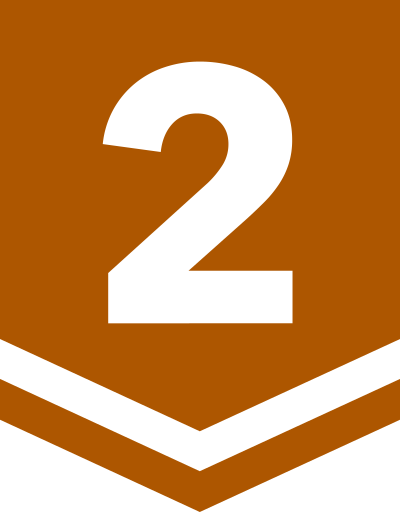
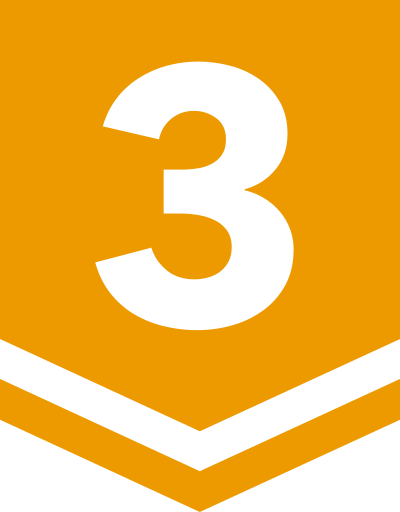
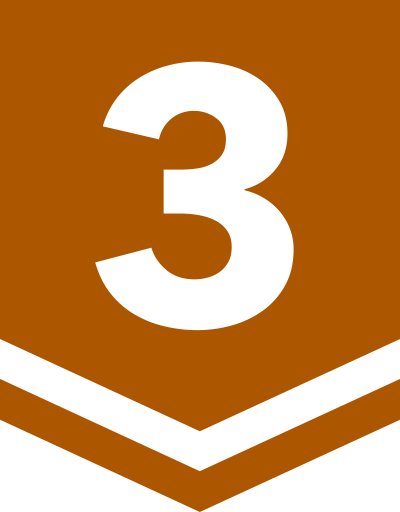

# daily-boj/krepe90

주 언어로 Python을 사용합니다.

## 지금까지 시도한 문제 목록
|Emoji|설명|
|:---:|---|
|✅|맞았습니다!|
|🟨|시간 초과|
|🟧|런타임/컴파일 에러 등등|
|🟥|틀렸습니다|
|⬛|아직 풀지 않음|

<!-- TABLE START -->
|날짜||문제|성공 여부|풀이|메모|
|---|:---:|---|:---:|---|---|
|2020-06-08||[2028. 자기복제수](https://www.acmicpc.net/problem/2028)|✅|[python](src/python/P2028.py)||
|2020-06-08||[5397. 키로거](https://www.acmicpc.net/problem/5397)|🟨|[python](src/python/P5397.py)||
|2020-06-09||[2684. 동전 게임](https://www.acmicpc.net/problem/2684)|✅|[python](src/python/P2684.py)|주석|
|2020-06-10||[14581. 팬들에게 둘러싸인 홍준](https://www.acmicpc.net/problem/14581)|✅|[python](src/python/P14581.py)||
|2020-06-10||[17253. 삼삼한 수 2](https://www.acmicpc.net/problem/17253)|✅|[python](src/python/P17253.py)|주석|
|2020-06-10||[2411. 아이템 먹기](https://www.acmicpc.net/problem/2411)|✅|[python](src/python/P2411.py)|[Markdown](docs/P2411.md)|
|2020-06-11||[3062. 수 뒤집기](https://www.acmicpc.net/problem/3062)|✅|[python](src/python/P3062.py)||
|2020-06-12||[1236. 성 지키기](https://www.acmicpc.net/problem/1236)|✅|[python](src/python/P1236.py)||
|2020-06-12||[1081. 합](https://www.acmicpc.net/problem/1081)|✅|[python](src/python/P1081.py)|[Markdown](docs/P1081.md)|
|**2020-06-14**||[1504. 특정한 최단 경로](https://www.acmicpc.net/problem/1504)|⬛|[python](src/python/P1504.py)||
|2020-06-29||[1459. 걷기](https://www.acmicpc.net/problem/1459)|✅|[python](src/python/P1459.py)||
|2020-06-29||[3186. 소변기](https://www.acmicpc.net/problem/3186)|✅|[python](src/python/P3186.py)||
|2020-06-30||[17294. 귀여운 수~ε٩(๑> ₃ <)۶з](https://www.acmicpc.net/problem/17294)|✅|[python](src/python/P17294.py)||
|2020-06-30||[15565. 귀여운 라이언](https://www.acmicpc.net/problem/15565)|✅|[python](src/python/P15565.py)||
|2020-07-07||[2033. 반올림](https://www.acmicpc.net/problem/2033)|✅|[python](src/python/P2033.py)||
|2020-07-07||[3372. 보드 점프](https://www.acmicpc.net/problem/3372)|✅|[python](src/python/P3372.py)||
|2020-07-08||[12090. 초성 변환](https://www.acmicpc.net/problem/12090)|✅|[python](src/python/P12090.py)||
|2020-07-08||[13699. 점화식](https://www.acmicpc.net/problem/13699)|✅|[python](src/python/P13699.py)||
|2020-07-09||[2546. 경제학과 정원영](https://www.acmicpc.net/problem/2546)|✅|[python](src/python/P2546.py)||
|2020-07-09||[2502. 떡 먹는 호랑이](https://www.acmicpc.net/problem/2502)|✅|[python](src/python/P2502.py)||
|2020-07-09||[5015. ls](https://www.acmicpc.net/problem/5015)|🟨|[python](src/python/P5015.py)||
|2020-07-10||[7481. ATM놀이](https://www.acmicpc.net/problem/7481)|✅|[python](src/python/P7481.py)||
|2020-07-10||[14400. 편의점 2](https://www.acmicpc.net/problem/14400)|✅|[python](src/python/P14400.py)||
|2020-07-10||[13710. XOR 합 3](https://www.acmicpc.net/problem/13710)|🟨|[python](src/python/P13710.py)||
|**2020-07-11**||[13710. XOR 합 3](https://www.acmicpc.net/problem/13710)|✅|[python](src/python/P13710.py)||
|2021-06-28||[15881. Pen Pineapple Apple Pen](https://www.acmicpc.net/problem/15881)|✅|[python](src/python/P15881.py)||
|2021-06-28||[2232. 지뢰](https://www.acmicpc.net/problem/2232)|✅|[python](src/python/P2232.py)||
|2021-06-29||[1032. 명령 프롬프트](https://www.acmicpc.net/problem/1032)|✅|[python](src/python/P1032.py)||
|2021-06-29||[4172. sqrt log sin](https://www.acmicpc.net/problem/4172)|✅|[python](src/python/P4172.py)||
|2024-11-05||[1149. RGB거리](https://www.acmicpc.net/problem/1149)|✅|[python](src/python/P1149.py)||
|2024-11-07||[2217. 로프](https://www.acmicpc.net/problem/2217)|✅|[python](src/python/P2217.py)||
|2024-11-07||[12852. 1로 만들기 2](https://www.acmicpc.net/problem/12852)|✅|[python](src/python/P12852.py)||
|2024-11-08||[1026. 보물](https://www.acmicpc.net/problem/1026)|✅|[python](P1026.py)||
|2024-11-08||[11727. 2×n 타일링 2](https://www.acmicpc.net/problem/11727)|✅|[python](P11727.py)||
|2024-11-09||[2847. 게임을 만든 동준이](https://www.acmicpc.net/problem/2847)|✅|[python](src/python/P2847.py)||
|2024-11-09||[1932. 정수 삼각형](https://www.acmicpc.net/problem/1932)|✅|[python](src/python/P1932.py)||
|2024-11-10||[2193. 이친수](https://www.acmicpc.net/problem/2193)|✅|[python](src/python/P2193.py)||
|2024-11-10||[11053. 가장 긴 증가하는 부분 수열](https://www.acmicpc.net/problem/11053)|✅|[python](src/python/P11053.py)||
|2024-11-11||[9655. 돌 게임](https://www.acmicpc.net/problem/9655)|✅|[python](src/python/P9655.py)||
|2024-11-11||[15903. 카드 합체 놀이](https://www.acmicpc.net/problem/15903)|✅|[python](src/python/P15903.py)||
|2024-11-12||[14501. 퇴사](https://www.acmicpc.net/problem/14501)|✅|[python](src/python/P14501.py)||
|2024-11-12||[15486. 퇴사 2](https://www.acmicpc.net/problem/15486)|✅|[python](src/python/P15486.py)||
|2024-11-13||[9657. 돌 게임 3](https://www.acmicpc.net/problem/9657)|✅|[python](src/python/P9657.py)||
|2024-11-13||[10844. 쉬운 계단 수](https://www.acmicpc.net/problem/10844)|✅|[python](src/python/P10844.py)||
|2024-11-14||[1788. 피보나치 수의 확장](https://www.acmicpc.net/problem/1788)|✅|[python](src/python/P1788.py)||
|2024-11-14||[2302. 극장 좌석](https://www.acmicpc.net/problem/2302)|✅|[python](src/python/P2302.py)||
|2024-11-15||[1439. 뒤집기](https://www.acmicpc.net/problem/1439)|✅|[python](src/python/P1439.py)||
|2024-11-16||[11501. 주식](https://www.acmicpc.net/problem/11501)|✅|[python](src/python/P11501.py)||
|2024-11-16||[2240. 자두나무](https://www.acmicpc.net/problem/2240)|⬛|[python](src/python/P2240.py)||
|2024-11-17||[1912. 연속합](https://www.acmicpc.net/problem/1912)|✅|[python](src/python/P1912.py)||
|2024-11-17||[2170. 선 긋기](https://www.acmicpc.net/problem/2170)|✅|[python](src/python/P2170.py)||
|2024-11-18||[2748. 피보나치 수 2](https://www.acmicpc.net/problem/2748)|✅|[python](src/python/P2748.py)||
|2024-11-18||[2156. 포도주 시식](https://www.acmicpc.net/problem/2156)|✅|[python](src/python/P2156.py)||
|2024-11-19||[1699. 제곱수의 합](https://www.acmicpc.net/problem/1699)|✅|[python](src/python/P1699.py)||
|2024-11-19||[11000. 강의실 배정](https://www.acmicpc.net/problem/11000)|✅|[python](src/python/P11000.py)||
|2024-11-20||[25943. 양팔저울](https://www.acmicpc.net/problem/25943)|✅|[python](src/python/P25943.py)||
|2024-11-20||[1915. 가장 큰 정사각형](https://www.acmicpc.net/problem/1915)|✅|[python](src/python/P1915.py)||
|2024-11-21||[9372. 상근이의 여행](https://www.acmicpc.net/problem/9372)|✅|[python](src/python/P9372.py)||
|2024-11-22||[11055. 가장 큰 증가하는 부분 수열](https://www.acmicpc.net/problem/11055)|✅|[python](src/python/P11055.py)||
|2024-11-22||[2293. 동전 1](https://www.acmicpc.net/problem/2293)|✅|[python](src/python/P2293.py)||
|2024-11-24||[1541. 잃어버린 괄호](https://www.acmicpc.net/problem/1541)|✅|[python](src/python/P1541.py)||
|2024-11-24||[2294. 동전 2](https://www.acmicpc.net/problem/2294)|✅|[python](src/python/P2294.py)||
|2024-11-25||[2309. 일곱 난쟁이](https://www.acmicpc.net/problem/2309)|✅|[python](src/python/P2309.py)||
|2024-11-25||[1965. 상자넣기](https://www.acmicpc.net/problem/1965)|✅|[python](src/python/P1965.py)||
|2024-11-26||[10804. 카드 역배치](https://www.acmicpc.net/problem/10804)|✅|[python](src/python/P10804.py)||
|2024-11-26||[11052. 카드 구매하기](https://www.acmicpc.net/problem/11052)|✅|[python](src/python/P11052.py)||
|2025-01-06||[24723. 녹색거탑](https://www.acmicpc.net/problem/24723)|✅|[python](src/python/P24723.py)||
|2025-01-06||[15988. 1, 2, 3 더하기 3](https://www.acmicpc.net/problem/15988)|✅|[python](src/python/P15988.py)||
|2025-01-07||[25643. 문자열 탑 쌓기](https://www.acmicpc.net/problem/25643)|✅|[python](src/python/P25643.py)||
|2025-01-07||[16953. A → B](https://www.acmicpc.net/problem/16953)|✅|[python](src/python/P16953.py)||
|2025-01-08||[3943. 헤일스톤 수열](https://www.acmicpc.net/problem/3943)|✅|[python](src/python/P3943.py)||
|2025-01-08||[1927. 최소 힙](https://www.acmicpc.net/problem/1927)|✅|[python](src/python/P1927.py)||
|2025-01-09||[7568. 덩치](https://www.acmicpc.net/problem/7568)|✅|[python](src/python/P7568.py)||
|2025-01-09||[3273. 두 수의 합](https://www.acmicpc.net/problem/3273)|✅|[python](src/python/P3273.py)||
|2025-01-10||[3034. 앵그리 창영](https://www.acmicpc.net/problem/3034)|✅|[python](src/python/P3034.py)||
|2025-01-10||[1780. 종이의 개수](https://www.acmicpc.net/problem/1780)|⬛|[python](src/python/P1780.py)||
|2025-01-12||[1292. 쉽게 푸는 문제](https://www.acmicpc.net/problem/1292)|✅|[python](src/python/P1292.py)||
|2025-01-12||[15652. N과 M (4)](https://www.acmicpc.net/problem/15652)|✅|[python](src/python/P15652.py)||
|2025-01-12||[32749. 타노수](https://www.acmicpc.net/problem/32749)|✅|[python](src/python/P32749.py)||
|2025-01-12||[3986. 좋은 단어](https://www.acmicpc.net/problem/3986)|✅|[python](src/python/P3986.py)||
|2025-01-13||[4949. 균형잡힌 세상](https://www.acmicpc.net/problem/4949)|✅|[python](src/python/P4949.py)||
|2025-01-14||[6359. 만취한 상범](https://www.acmicpc.net/problem/6359)|✅|[python](src/python/P6359.py)||
|2025-01-26||[25286. 11월 11일](https://www.acmicpc.net/problem/25286)|✅|[python](src/python/P25286.py)||
|2025-01-26||[19583. 싸이버개강총회](https://www.acmicpc.net/problem/19583)|✅|[python](src/python/P19583.py)||
|2025-01-27||[17826. 나의 학점은?](https://www.acmicpc.net/problem/17826)|✅|[python](src/python/P17826.py)||
|2025-01-29||[31628. 가지 한 두름 주세요](https://www.acmicpc.net/problem/31628)|✅|[python](src/python/P31628.py)||
|2025-01-29||[29722. 브실혜성](https://www.acmicpc.net/problem/29722)|✅|[python](src/python/P29722.py)||
|2025-01-30||[23756. 노브 돌리기](https://www.acmicpc.net/problem/23756)|✅|[python](src/python/P23756.py)||
|2025-01-31||[25400. 제자리](https://www.acmicpc.net/problem/25400)|✅|[python](src/python/P25400.py)||
|2025-02-01||[2587. 대표값2](https://www.acmicpc.net/problem/2587)|✅|[python](src/python/P2587.py)||
|2025-02-03||[1894. 4번째 점](https://www.acmicpc.net/problem/1894)|✅|[python](src/python/P1894.py)||
|2025-03-09||[21736. 헌내기는 친구가 필요해](https://www.acmicpc.net/problem/21736)|✅|[python](src/python/P21736.py)||
|2025-03-10||[32779. 가희와 전기 요금 1](https://www.acmicpc.net/problem/32779)|✅|[python](src/python/P32779.py)||
|2025-03-10||[30804. 과일 탕후루](https://www.acmicpc.net/problem/30804)|✅|[python](src/python/P30804.py)||
|2025-03-11||[16435. 스네이크버드](https://www.acmicpc.net/problem/16435)|✅|[python](src/python/P16435.py)||
|2025-03-11||[31462. 삼각 초콜릿 포장 (Sweet)](https://www.acmicpc.net/problem/31462)|✅|[python](src/python/P31462.py)||
|2025-03-12||[25183. 인생은 한 방](https://www.acmicpc.net/problem/25183)|✅|[python](src/python/P25183.py)||
|2025-03-13||[2999. 비밀 이메일](https://www.acmicpc.net/problem/2999)|✅|[python](src/python/P2999.py)||
|2025-03-14||[33541. 2025는 무엇이 특별할까?](https://www.acmicpc.net/problem/33541)|✅|[python](src/python/P33541.py)||
|2025-03-16||[21771. 가희야 거기서 자는 거 아니야](https://www.acmicpc.net/problem/21771)|✅|[python](src/python/P21771.py)||
|2025-03-17||[16561. 3의 배수](https://www.acmicpc.net/problem/16561)|✅|[python](src/python/P16561.py)||
|2025-03-18||[5220. Error Detection](https://www.acmicpc.net/problem/5220)|✅|[python](src/python/P5220.py)||
|2025-03-19||[6500. 랜덤 숫자 만들기](https://www.acmicpc.net/problem/6500)|✅|[python](src/python/P6500.py)||
|2025-03-20||[2446. 별 찍기 - 9](https://www.acmicpc.net/problem/2446)|✅|[python](src/python/P2446.py)||
|2025-03-21||[1225. 이상한 곱셈](https://www.acmicpc.net/problem/1225)|✅|[python](src/python/P1225.py)||
|2025-03-23||[26416. New Password](https://www.acmicpc.net/problem/26416)|✅|[python](src/python/P26416.py)||
|2025-03-23||[20360. Binary numbers](https://www.acmicpc.net/problem/20360)|✅|[python](src/python/P20360.py)||
|2025-03-24||[31458. !!초콜릿 중독 주의!!](https://www.acmicpc.net/problem/31458)|✅|[python](src/python/P31458.py)||
|2025-03-25||[2576. 홀수](https://www.acmicpc.net/problem/2576)|✅|[python](src/python/P2576.py)||
|2025-03-26||[10093. 숫자](https://www.acmicpc.net/problem/10093)|✅|[python](src/python/P10093.py)||
|2025-03-27||[25305. 커트라인](https://www.acmicpc.net/problem/25305)|✅|[python](src/python/P25305.py)||
|2025-03-28||[10867. 중복 빼고 정렬하기](https://www.acmicpc.net/problem/10867)|✅|[python](src/python/P10867.py)||
|2025-03-29||[2628. 종이자르기](https://www.acmicpc.net/problem/2628)|✅|[python](src/python/P2628.py)||
|2025-03-30||[9455. 박스](https://www.acmicpc.net/problem/9455)|✅|[python](src/python/P9455.py)||
|2025-03-31||[10811. 바구니 뒤집기](https://www.acmicpc.net/problem/10811)|✅|[python](src/python/P10811.py)||
|2025-04-01||[17247. 택시 거리](https://www.acmicpc.net/problem/17247)|✅|[python](src/python/P17247.py)||
|2025-04-02||[11121. Communication Channels](https://www.acmicpc.net/problem/11121)|✅|[python](src/python/P11121.py)||
|2025-04-02||[11116. 교통량](https://www.acmicpc.net/problem/11116)|✅|[python](src/python/P11116.py)||
|2025-04-03||[10808. 알파벳 개수](https://www.acmicpc.net/problem/10808)|✅|[python](src/python/P10808.py)||
|2025-04-03||[10815. 숫자 카드](https://www.acmicpc.net/problem/10815)|✅|[python](src/python/P10815.py)||
|2025-04-04||[31923. 마라탕후루](https://www.acmicpc.net/problem/31923)|✅|[python](src/python/P31923.py)||
|2025-04-04||[3042. 트리플렛](https://www.acmicpc.net/problem/3042)|✅|[python](src/python/P3042.py)||
|2025-04-05||[32762. 더치 페이](https://www.acmicpc.net/problem/32762)|✅|[python](src/python/P32762.py)||
|2025-04-05||[15815. 천재 수학자 성필](https://www.acmicpc.net/problem/15815)|✅|[python](src/python/P15815.py)||
|2025-04-06||[9358. 순열 접기 게임](https://www.acmicpc.net/problem/9358)|✅|[python](src/python/P9358.py)||
|2025-04-07||[16410. Goat Rope](https://www.acmicpc.net/problem/16410)|✅|[python](src/python/P16410.py)||
|2025-04-07||[10164. 격자상의 경로](https://www.acmicpc.net/problem/10164)|✅|[python](src/python/P10164.py)||
|2025-04-09||[19947. 투자의 귀재 배주형](https://www.acmicpc.net/problem/19947)|✅|[python](src/python/P19947.py)||
|2025-04-09||[31826. 주식 시장](https://www.acmicpc.net/problem/31826)|✅|[python](src/python/P31826.py)||
|2025-04-10||[13416. 주식 투자](https://www.acmicpc.net/problem/13416)|✅|[python](src/python/P13416.py)||
|2025-04-11||[1919. 애너그램 만들기](https://www.acmicpc.net/problem/1919)|✅|[python](src/python/P1919.py)||
|2025-04-11||[5567. 결혼식](https://www.acmicpc.net/problem/5567)|✅|[python](src/python/P5567.py)||
